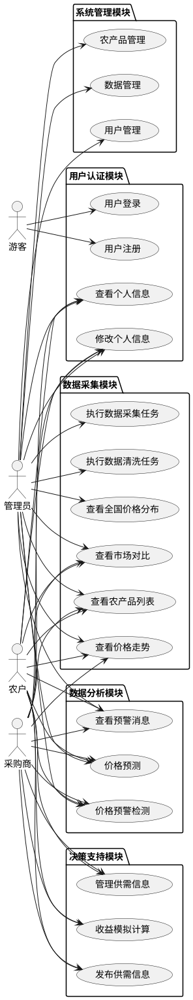

# 4 系统设计

## 4.1 系统总体架构设计

本系统采用前后端分离的B/S架构，整体分为前端展示层、后端服务层和数据存储层三层结构。

前端展示层使用Vue 3框架开发，通过Vite构建工具进行打包部署。前端调用后端RESTful API获取数据，使用Element Plus组件库构建用户界面，ECharts图表库实现数据可视化。

后端服务层基于Django框架构建，包含用户认证、数据采集、数据分析、决策支持四个应用模块。Django REST Framework提供API接口服务，PyTorch实现LSTM神经网络的价格预测功能。

数据存储层采用MySQL关系型数据库存储结构化数据，文件系统中保存LSTM模型文件和归一化器。

系统整体架构如图4-1所示。用户通过浏览器访问前端界面发起请求，前端通过Axios向Django后端API发送HTTP请求，后端处理业务逻辑后与MySQL数据库交互，对于价格预测请求调用PyTorch LSTM模型进行计算，结果返回前端渲染展示。

## 4.2 系统功能模块设计

系统功能划分为六个核心模块，各模块职责如下：

**数据采集模块**：负责从外部数据源抓取农产品价格数据，包括爬虫程序和定时任务调度。模块从农业农村部数据平台等渠道获取数据，解析后存储到price_history表。

**数据清洗模块**：对原始价格数据进行质量处理，包括缺失值填补、异常值检测与标记、数据去重等操作。清洗后的数据存储到cleaned_price_data表供分析和预测使用。

**价格预测模块**：核心业务模块，基于LSTM神经网络进行价格预测。模块从数据库读取历史数据，进行预处理后调用训练好的模型进行预测，预测结果返回前端展示。

**价格预警模块**：根据预测结果检测异常价格波动。模块设定涨跌阈值，当预测价格变化超过阈值时自动生成预警消息并推送给相关用户。

**收益模拟模块**：为用户提供收益计算功能。模块接收用户输入的成本参数，结合价格预测结果计算不同方案的预期收益，生成个性化经营建议。

**数据可视化模块**：集成ECharts图表库，实现价格走势折线图、全国热力图、地区对比柱状图等多种可视化展示。

### 4.2.1 系统用例图

系统用例图如图4-2所示。

## 4.3 数据库设计

### 4.3.1 数据库概念设计（E-R图）

系统包含以下主要实体及其属性：

**用户实体（CustomUser）**：存储用户基本信息，包括用户名、密码、角色（农户/采购商/管理员）、联系方式等。

**农产品实体（AgriculturalProduct）**：存储农产品分类信息，包括品名、类别（蔬菜/水果/畜禽/水产/粮油/其他）、产地、单位等。

**价格历史实体（PriceHistory）**：存储原始价格数据，包括日期、市场名称、平均价、最高价、最低价、交易量、数据来源等。

**清洗价格数据实体（CleanedPriceData）**：存储清洗后的价格数据，在原始数据基础上增加异常标记字段。

**系统消息实体（SystemMessage）**：存储预警消息，包括消息标题、内容、类型、优先级、已读状态等。

**供需信息实体（TradeInfo）**：存储用户发布的供需信息，包括产品、标题、内容、价格、数量、状态等。

各实体间的联系包括：用户与系统消息为一对多关系，用户与供需信息为一对多关系，农产品与价格数据为一对多关系。

### 4.3.2 数据库逻辑设计

根据E-R图设计逻辑模型，主要关系如下：

用户表（users）与系统消息表（system_messages）为一对多关系，外键为user_id。用户可以发布多条供需信息，供需信息表（trade_info）通过publisher_id关联用户。

农产品表（agricultural_products）与价格历史表（price_history）为一对多关系，外键为product_id。同理，农产品表与清洗价格数据表（cleaned_price_data）也为一对多关系。

农产品表与供需信息表（trade_info）为一对多关系，外键为product_id。

### 4.3.3 主要数据表结构

**用户表（users）**：

| 字段名 | 数据类型 | 说明 |
|--------|----------|------|
| id | INT | 主键，自增 |
| username | VARCHAR(150) | 用户名，唯一 |
| email | VARCHAR(254) | 邮箱 |
| password | VARCHAR(128) | 密码哈希 |
| role | VARCHAR(20) | 角色：farmer/buyer/admin |
| phone | VARCHAR(20) | 手机号 |
| address | VARCHAR(255) | 地址 |
| is_active | BOOLEAN | 是否激活 |
| created_at | DATETIME | 创建时间 |

**农产品表（agricultural_products）**：

| 字段名 | 数据类型 | 说明 |
|--------|----------|------|
| id | INT | 主键，自增 |
| name | VARCHAR(100) | 品名 |
| category | VARCHAR(20) | 类别 |
| origin | VARCHAR(200) | 产地 |
| unit | VARCHAR(20) | 单位，默认CNY/kg |
| is_active | BOOLEAN | 是否启用 |

**原始价格数据表（price_history）**：

| 字段名 | 数据类型 | 说明 |
|--------|----------|------|
| id | INT | 主键，自增 |
| product_id | INT | 关联农产品ID |
| date | DATE | 日期 |
| market_name | VARCHAR(200) | 市场名称 |
| avg_price | DECIMAL(10,4) | 平均价格 |
| max_price | DECIMAL(10,4) | 最高价 |
| min_price | DECIMAL(10,4) | 最低价 |
| volume | BIGINT | 交易量 |
| source | VARCHAR(100) | 数据来源 |
| remarks | TEXT | 备注 |

**清洗价格数据表（cleaned_price_data）**：

| 字段名 | 数据类型 | 说明 |
|--------|----------|------|
| id | INT | 主键，自增 |
| product_id | INT | 关联农产品ID |
| date | DATE | 日期 |
| market_name | VARCHAR(200) | 市场名称 |
| avg_price | DECIMAL(10,4) | 平均价格 |
| max_price | DECIMAL(10,4) | 最高价 |
| min_price | DECIMAL(10,4) | 最低价 |
| volume | BIGINT | 交易量 |
| is_outlier | BOOLEAN | 是否异常值 |
| outlier_reason | VARCHAR(100) | 异常原因 |

**系统消息表（system_messages）**：

| 字段名 | 数据类型 | 说明 |
|--------|----------|------|
| id | INT | 主键，自增 |
| user_id | INT | 接收用户ID |
| title | VARCHAR(200) | 消息标题 |
| content | TEXT | 消息内容 |
| message_type | VARCHAR(20) | 消息类型 |
| priority | VARCHAR(10) | 优先级 |
| is_read | BOOLEAN | 是否已读 |
| price_change_percent | DECIMAL(6,2) | 价格变动百分比 |

## 4.4 LSTM预测模型设计

### 4.4.1 数据预处理

原始价格数据在输入模型前需要经过预处理，步骤如下：

首先从MySQL数据库读取cleaned_price_data表中最近365天的清洗后价格数据，按日期聚合取多市场均值，确保数据的连续性和完整性。

然后进行归一化处理，使用MinMaxScaler将价格值映射到0至1区间。归一化后的数据能加快模型收敛速度，避免不同量纲对训练的影响。

接着构造滑动窗口序列，设置窗口长度为7天，即用过去7天的价格数据预测下一天的价格。将归一化后的价格数组转换为特征序列X和标签序列Y。

最后划分训练集和测试集，训练集占80%，测试集占20%。使用PyTorch的DataLoader封装数据，设置批次大小为16。

### 4.4.2 模型结构设计

LSTM价格预测模型采用双层LSTM结构，具体设计如下：

输入层接收形状为(batch_size, 7, 1)的张量，表示一个批次中每个样本的7天历史价格数据。

第一层LSTM设置隐藏单元数为64，序列长度7。第二层LSTM同样设置64个隐藏单元。双层LSTM能够提取更深层的时序特征。

Dropout层设置丢弃率为0.2，防止模型过拟合。

全连接输出层将64维隐藏状态映射到1维输出，得到预测价格值。

模型输出后需要反归一化，将预测值转换回原始价格尺度。

### 4.4.3 训练策略

模型训练采用以下策略：

损失函数使用均方误差MSE，优化器使用Adam，学习率设置为0.001。训练过程中使用梯度裁剪，将梯度值限制在1.0以内，避免梯度爆炸。

训练轮次设置为100轮，每10轮打印一次训练和测试损失。每轮遍历全部训练数据计算平均损失，验证集评估模型泛化能力。

模型保存采用state_dict方式保存模型参数，保存归一化器用于后续预测时的反归一化操作。模型文件保存路径为backend/models/lstm/lstm_model.pth，归一化器保存路径为backend/models/lstm/scaler.pkl。

评估指标包括MSE、RMSE、MAE和R2分数，用于衡量预测结果与真实值的偏差程度。

## 4.5 系统接口设计

系统后端提供RESTful API接口，前端通过Axios调用接口获取数据。

**用户认证接口**（/api/auth/）：

| 接口路径 | 方法 | 说明 |
|----------|------|------|
| /api/auth/login/ | POST | 用户登录 |
| /api/auth/register/ | POST | 用户注册 |
| /api/auth/logout/ | POST | 用户登出 |
| /api/auth/user/ | GET | 获取用户信息 |

**数据采集接口**（/api/data-collection/）：

| 接口路径 | 方法 | 说明 |
|----------|------|------|
| /api/data-collection/products/ | GET | 获取农产品列表 |
| /api/data-collection/prices/ | GET | 查询价格数据 |
| /api/data-collection/cleaned/ | GET | 查询清洗后数据 |
| /api/data-collection/prices/trend/ | GET | 获取价格走势 |
| /api/data-collection/prices/comparison/ | GET | 获取市场对比 |
| /api/data-collection/dashboard/summary/ | GET | 获取仪表盘摘要 |

**数据分析接口**（/api/data-analysis/）：

| 接口路径 | 方法 | 说明 |
|----------|------|------|
| /api/data-analysis/prediction/ | GET | 价格预测 |
| /api/data-analysis/prediction/products/ | GET | 可预测产品列表 |
| /api/data-analysis/warning/check/ | POST | 价格异常检测 |
| /api/data-analysis/warning/list/ | GET | 预警消息列表 |

**决策支持接口**（/api/decision-support/）：

| 接口路径 | 方法 | 说明 |
|----------|------|------|
| /api/decision-support/trades/ | GET/POST | 供需信息管理 |
| /api/decision-support/trades/mine/ | GET | 我的发布 |
